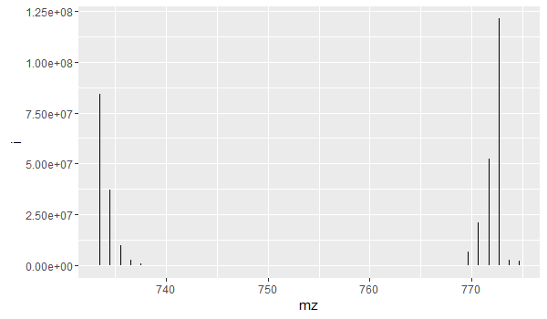

#Credential Features

Credential metabolomic datasets based on isotopic signatures.

##Reference
http://pubs.acs.org/doi/abs/10.1021/ac503092d


##Installation
````r
#install.packages("devtools")
devtools::install_github("pattilab/credential")
````


##Example _credential()_ Usage
````r
library(credential)

features = readRDS(system.file("data", "features.rds", package="credential"))
features
```

    > features
          cc       mz       rt           i
     1: 9526 733.5030 398.8465  84027638.4
     2: 9534 734.5062 398.9518  37360960.9
     3: 9542 735.5091 398.7643   9808130.0
     4: 9550 736.5122 398.8902   3004574.5
     5: 9558 737.5153 398.8701   1061971.0
     6: 9567 738.5207 399.0963    322398.5
     7: 4118 769.6240 398.8240   7058049.3
     8: 4129 770.6269 398.8641  21161998.5
     9: 4133 771.6300 398.7786  52582899.5
    10: 4135 772.6332 398.9332 121114702.0
    11: 4139 773.6373 398.8728   2773286.7
    12: 4144 774.6374 398.7884   2538351.9

```r
knots = findknots(features, .zs=1:2, ppmwid=4, rtwid = 1, cd = 13.00335-12)
```

    > knots
    $cc_knot
          cc knot  tail
     1: 4118    2 FALSE
     2: 4129    2 FALSE
     3: 4133    2 FALSE
     4: 4135    2 FALSE
     5: 4139    2  TRUE
     6: 4144    2  TRUE
     7: 9526    1 FALSE
     8: 9534    1 FALSE
     9: 9542    1 FALSE
    10: 9550    1 FALSE
    11: 9558    1 FALSE
    12: 9567    1 FALSE

    $knot
       knot      meanr   meanmz   mainmz       rt      maxi n        dir z
    1:    2 0.05364496 772.1315 772.6332 398.8435 121114702 6  0.3139081 1
    2:    1 0.05386352 736.0111 733.5030 398.9032  84027638 6 -0.1992326 1

```r
knots = fixmergedquipu(knot, features)

credentials = credentialknots(knots$knot, ppmwid = 9, rtwid = 1, mpc = c(12, 120), ratio = 1/1, ratio.lim = 0.1, maxnmer = 4, cd = 13.00335-12)
```

    > credentials
    $knot_quipu
       knot quipu
    1:    2     1
    2:    1     1

    $quipu
       quipu minsupport maxsupport nknot
    1:     1          6          6     2

```r
df = features[knots$cc_knot[credentials$knot_quipu[quipu == 1],,on="knot"],,on="cc"]
ggplot(df) + geom_segment(aes(x = mz, xend = mz, yend = 0, y = i))
```


